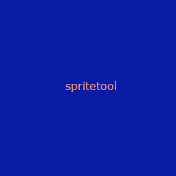
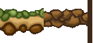

# spritetool

- Extracts Worms Armageddon graphics archives (.dir) and decodes the sprites and images inside them to BMP and animated GIF.

- Packs Terrains performing various checks to make sure the packed terrain is legitimate.

[extras/](extras/) holds tools to experiment with animations:
grass that sways, bubbles that rise, insects that mill about.

The `.spr` sprite format has no public specification; it was reverse engineered
for this tool and is documented in [SPR_FORMAT.md](SPR_FORMAT.md).

## Requirements

Python 3.8 or newer, and [Pillow](https://pypi.org/project/Pillow/).

```bash
pip install pillow
```

## Install

```bash
git clone https://github.com/EdLud/spritetool
cd spritetool
```

## Usage

### List an archive

```bash
python3 wa_spritetool.py list Gfx.dir
```

### Extract raw files

```bash
python3 wa_spritetool.py extract Gfx.dir output/
```

Writes the archive's files unchanged, preserving any internal subdirectories.

### Decode a map

```bash
python3 wa_spritetool.py land land001.dat output/
python3 wa_spritetool.py land Ropetm01.WSM output/
```

Writes the terrain as BMPs — the visible land, the collision mask and the
background layer — plus a `.txt` with the map's dimensions, water height,
texture path and object placements.

### Build an archive

```bash
python3 wa_spritetool.py pack my-water/
python3 wa_spritetool.py pack my-water/ output/
```

Point it at a folder and it works out the rest. A picture with a `.spd` beside
it is a sprite, any other picture is an image, and everything else rides along
untouched — that is all a `.dir` is. Subfolders become the `hi\name.img` style
entries the game's own archives use.

## Build a terrain 0 - Preface

A terrain is a folder holding 2 or 3 files, stored under /Worms Armageddon/DATA/Levels/.

The terrain "my-terrain" looks like this on the disk:

```
/Worms Armageddon/DATA/Levels/my-terrain/
├── Level.dir       all the main assets of the terrain (object, non-object, sprite override)
├── TEXT.img        from icon.png, which must be 64x64
└── Water.dir       the water animation and drowining sprites, optional
```

If there are certain assets missing in Level.dir or if TEXT.IMG is malformed in some way, 
the game will crash when loading the terrain. That's why our tool performs various checks
on the assets and offers examplary defaults for the user to study.

### Build a terrain 1 - The Command

```bash
python3 wa_spritetool.py pack-terrain build/
python3 wa_spritetool.py pack-terrain build/ output/
```

The output folder may not be the source folder. Leave the
output off and a `<name> packed` folder is made beside the source.

The input folder has to be called `build`.

- the **non-object assets** are found by their fixed names: `text.img`, `soil.img`,
  `grass.img`, `gradient.img`, `bridge.img`, `bridge-l.img`, `bridge-r.img`,
  `back.spr`, `_back.spr`, `back2.spr`, `front.spr`, `debris.spr` (see further down)
- a picture with a `.spd` beside it is a **sprite**; any other picture that is
  not one of the above asset is treated as an **object**, so objects can be named anything
- **sprite overrides** are read from a `gfx`, `gfx0` or `gfx1` subfolder

`toaster.img.bmp` is the default WA spelling and works, but the `.img` is
optional here: a plain `toaster.bmp` means the same thing, since an object is
always an `.img` in the archive. Possible forms are:

`toaster.png`
`toaster.img.png`
`toaster.img.bmp`
`toaster.bmp`

Should there be multiple occurances of the same object with different suffixes,
the build will fail and report the error. For the rest of the readme we'll use the `.png`
suffix.

Both commands also take a optional `<name>.dir.txt` listing for backwards compability with spriteEditor.exe.

```bash
python3 wa_spritetool.py pack-terrain Level.dir.txt output/
```

| Flag | Effect |
|---|---|
| `--no-compress-img` | store images uncompressed |
| `--no-recreate` | reuse an existing `.spr`/`.img`* instead of rebuilding from BMP |
| `--opaque-img` | treat images as having no transparent colour |
| `--force` | write the archive even if it would not load |
| `--defaults` | take anything missing from `presets/`** without asking |
| `--no-defaults` | never take any of it |
| `--no-output-inf` | do not write object settings back into the folder |
| `--write-palette` | draw the terrain's colours to `palette.png` |
| `--read-palette` | fit every picture to the colours in `palette.png` |
| `--no-palette` | cut no shared palette; each picture keeps its own |

*  - see `the spd format - sprite configuration `
**  - see further down

### Build a terrain 2 - Core Assets, Optional Assets, Defaults

A terrain has a minimum set of requirements for it to load ingame. `pack-terrain` will refuse to pack a terrain
unless all those files are present. If some files are missing, default files are offered to the user which will be 
written into `/build`. 
The defaults spend **none** of the 112-colour budget.

MUST haves:

- a land texture (`text.png`). Dimensions: 256 x 256 

- a soil texture (`soil.png`). Dimensions: 256 x 256 
- a grass texture (`grass.png`). Dimensions: 136 pixels wide, variable height. This is a an image that combines 3 parts: floor (64 pixels wide), ceiling (64 pixels wide), the colour that is shown when terrain is destroyed (8 pixels wide).

- a sky gradient (`gradient.png`). Dimensions: 8 x 916
- 3 bridge pieces (`bridge-l.png`), (`bridge.png`), (`bridge-r.png`). Dimensions: 64 pixels wide, variable height.
   
- an icon (`icon.png`) (traditionally this was called `TEXT.img.bmp`, which was confusing but is still accepted, the tool will treat a 64x64 picture as logo and a 256x256 picture as texture, should the author have confused the names). Dimensions: 64x64, 17 colours maximum.


- a soil texture (`soil.png`) Dimensions: 256 x 256
Default is an empty image.

Additionally it CAN have

- a non-animated background layer (`back.png`) Dimensions: 640 x 160


### Build a terrain 5 - PNG Sources and recolouring

A `.png` may stand in for the indexed `.bmp` anywhere, so art need not be
indexed by hand first, although this is still the recommended approach. 

The converting of a non-indexed `.png` to the indexed `.bmp` works like following:

- alpha is **thresholded at 128** -- at or above it a pixel is drawn, below it
  the pixel becomes index 0, the transparent one
- colours are reduced by median cut, and the mean distance they moved is
  printed, out of the 441 that spans the RGB cube

The reduction is done **once for the whole terrain**, not per picture. 
`pack-terrain` reads all the art first, cuts one palette across it, and
maps every PNG onto that. Already-indexed sources are packed exactly as
authored and their colours counted against the budget, leaving the rest for
the PNGs.

A terrain already inside the budget converts losslessly. Where both a `.bmp`
and a `.png` exist the `.bmp` wins, being already indexed and so authored
exactly.

`--write-palette` puts a `palette.png` in the build folder, the terrain's
colours as a grid of swatches, and says how many of the 112 are spent. 

`--no-palette` skips the shared cut entirely. Each picture keeps the colours
it was authored with, and an indexed source is packed exactly as it stands --
for an author who has already fitted their art to a palette they chose and
does not want it nudged to make room for the rest of the terrain. A terrain 
packed with this option may hold more than 112 colours.

`--read-palette` reads from `build/palette.png` and applies the colour 
to all .png AND .bmp files

### Object settings

`pack-terrain` keeps every object's settings in one `object_settings.txt`,
written into the folder on the first run and read on every one after:

```
// probability  1 to 10. Affects the chance of an object being placed, and is
//              relative to the values of other objects. Smaller objects, or
//              ones with a narrow base, typically have more places to appear.
// front        Whether the object is in front or behind the terrain.
//              0 = behind, 1 = in front
// soil         Whether the soil texture appears when the object is
//              destroyed. 0 = none, 1 = soil
// collide      Enables or disables collision. 1 = enabled, 0 = disabled
// nostack      Whether other objects can be placed onto this one.
//              0 = yes, 1 = no
// where        Where the object is placed. 2 = ceiling, 3 = floor, 0 or 1 =
//              the side of the terrain, saying which side of the object is
//              fixed to it, left (0) or right (1)

floor1.png
probability = 5
front = 0
soil = 0
collide = 1
nostack = 1
where = 3
```

Entries are written alphabetically and their order in `object_settings.txt`
carries no meaning -- the terrain is packed alphabetically whatever the file says.

If an object has a `.inf` file beside it holding it's settings , `pack-terrain` offers to
move the content into `object_settings.txt` and delete them; declining stops the
build rather than leave the settings in two places. A loose `.inf` file setting what
`object_settings.txt` already sets is refused outright, since there is no
saying which was meant.

`objectname.inf` and `objectname.txt` are both possible, if they are both present,
the `.inf` will be prioritized. After pack-terrain both files will be gone and copied into
`object_settings.txt`.
 

### Decode sprites and images

```bash
python3 wa_spritetool.py decompress Gfx.dir output/
python3 wa_spritetool.py decompress Gfx.dir output/ --gif
```

For each sprite this writes three files:

| File | Contents |
|---|---|
| `.spr` | decoded pixels, all frames stacked vertically |
| `.bmp` | the same sheet as an 8-bit indexed bitmap |
| `.spd` | frame count, dimensions, frame rate, playback flags |

A terrain's icon is not in the archive -- it sits beside it as `text.img` in
whatever casing its author used -- so it is written out as `icon.img.bmp`,
the name `pack-terrain` looks for. Without that a terrain taken apart and put
back together would lose its icon and be offered a default instead. The land
texture shares the name and is told apart by being 256x256 rather than 64x64.

Each image becomes a single `<name>.img.bmp`. Anything that is not a picture --
`.inf` object parameters, `index.txt`, fonts -- is copied through untouched,
and a `<name>.dir.txt` listing the archive's entries in order is written
alongside. The result is a folder `pack` builds straight back into a `.dir`,
with the objects, palettes and frame counts intact.

A sprite bank (`.bnk`) holds many unnamed animations sharing one palette, so
its sprites go in a folder named after the bank and are numbered in order:
`mainspr/0000.spr`, `mainspr/0001.spr`, and so on.

`--gif` additionally writes one animated GIF per sprite. It is off by default
because GIF encoding takes far longer than everything else combined: decoding
all 770 sprites in `Gfx.dir` takes about two seconds, and adding `--gif` turns
that into several minutes.

Output is grouped by source archive, so several archives can share one output
directory:

```
output/
├── Gfx/            decoded sprites
│   ├── airjetb.spr
│   ├── airjetb.spr.bmp
│   ├── airjetb.spr.spd
│   └── ...
└── Gfx gifs/       animations (only with --gif)
    ├── airjetb.gif
    └── ...
```

## Supported formats

| Format | Read | Write |
|---|---|---|
| `.dir` graphics directory | yes | yes |
| `.spr` sprite | yes | yes |
| `.img` image | yes | yes |
| `.bnk` sprite bank | yes | no |
| `land.dat` map | yes | no |

Archives from Worms Armageddon, Worms World Party Aqua and Online Worms are
all read. Their differences are handled automatically: Online Worms names its
sprites and images inside the file, and Aqua stores some of its graphics under
a second compression that has no published description, documented in
[AQUA_COMPRESSION.md](AQUA_COMPRESSION.md).

## Extras

[extras/](extras/) is a
set of tools to experiment with animations -- each in its own folder

```bash
python3 extras/make-grass-wind/make-grass-wind.py -o back2.spr.png
python3 extras/make-bubbles/make-bubbles.py --from layer.spr -o bubbles.png
```

Most write a PNG sprite strip and a GIF beside it, so the animation can be
looked at before the game sees it. See [extras/README.md](extras/README.md).

## Documentation

- [SPR_FORMAT.md](SPR_FORMAT.md) — the sprite format, as far as it is understood
- [AQUA_COMPRESSION.md](AQUA_COMPRESSION.md) — Aqua's second compression

## Credits

The Team17 compression algorithm was reverse engineered by acme_pjz and revised
by Pisto; the graphics directory format by Jon Skeet.

## License

GPL-3.0. See [LICENSE](LICENSE).

Worms Armageddon and its data are property of Team17. This repository contains
no game data — only the code to read it.
