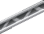
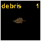
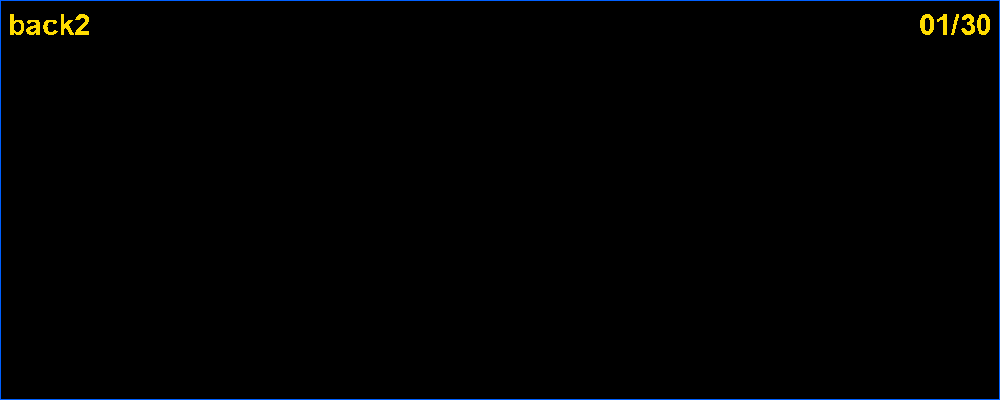
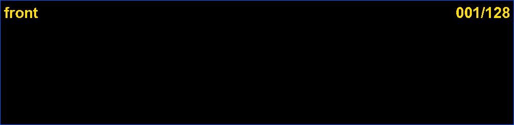

# spritetool

- Extracts Worms Armageddon graphics archives (.dir) and decodes the sprites and images inside them to BMP and animated GIF.

- Packs Terrains performing various checks to make sure the packed terrain is legitimate.

[extras/](extras/) holds tools to experiment with animations:
grass that sways, bubbles that rise, insects that mill about.

The `.spr` sprite format has no public specification; it was reverse engineered
for this tool and is documented in [SPR_FORMAT.md](SPR_FORMAT.md).

## Requirements

Python 3.8 or newer, and [Pillow](https://pypi.org/project/Pillow/).

```bash
pip install pillow
```

## Install

```bash
git clone https://github.com/EdLud/spritetool
cd spritetool
```

## Usage

### List an archive

```bash
python3 wa_spritetool.py list Gfx.dir
```

### Extract raw files

```bash
python3 wa_spritetool.py extract Gfx.dir output/
```

Writes the archive's files unchanged, preserving any internal subdirectories.

### Decode a map

```bash
python3 wa_spritetool.py land land001.dat output/
python3 wa_spritetool.py land Ropetm01.WSM output/
```

Writes the terrain as BMPs — the visible land, the collision mask and the
background layer — plus a `.txt` with the map's dimensions, water height,
texture path and object placements.

### Build an archive

```bash
python3 wa_spritetool.py pack my-water/
python3 wa_spritetool.py pack my-water/ output/
```

Point it at a folder and it works out the rest. A picture with a `.spd` beside
it is a sprite, any other picture is an image, and everything else rides along
untouched — that is all a `.dir` is. Subfolders become the `hi\name.img` style
entries the game's own archives use.

## Build a terrain 0 - Preface

A terrain is a folder holding 2 or 3 files, stored under /Worms Armageddon/DATA/Levels/.

The terrain "my-terrain" looks like this on the disk:

```
/Worms Armageddon/DATA/Levels/my-terrain/
├── Level.dir       all the main assets of the terrain (object, non-object, sprite override)
├── TEXT.img        from icon.png, which must be 64x64
└── Water.dir       the water animation and drowining sprites, optional
```

If there are certain assets missing in Level.dir or if TEXT.IMG is malformed in some way, 
the game will crash when loading the terrain. That's why our tool performs various checks
on the assets and offers examplary defaults for the user to study.

### Build a terrain 1 - The Command

```bash
python3 wa_spritetool.py pack-terrain build/
python3 wa_spritetool.py pack-terrain build/ output/
```

The output folder may not be the source folder. Leave the
output off and a `<name> packed` folder is made beside the source.

The first time a folder is packed, `pack-terrain` confirms it is meant to be
a terrain (`setup.confirm`), reporting what it found there -- any folder may
be one now; the name no longer has to be `build`. Saying yes writes
`settings.spritetool.toml` to the folder and packs; saying no stops.

- the **non-object assets** are found by their fixed names: `text.img`, `soil.img`,
  `grass.img`, `gradient.img`, `bridge.img`, `bridge-l.img`, `bridge-r.img`,
  `back.spr`, `_back.spr`, `back2.spr`, `front.spr`, `debris.spr` (see further down)
- a picture with a `.spd` beside it is a **sprite**; any other picture that is
  not one of the above asset is treated as an **object**, so objects can be named anything
- **sprite overrides** are read from a `gfx`, `gfx0` or `gfx1` subfolder

`toaster.img.bmp` is the default WA spelling and works, but the `.img` is
optional here: a plain `toaster.bmp` means the same thing, since an object is
always an `.img` in the archive. Possible forms are:

`toaster.png`
`toaster.img.png`
`toaster.img.bmp`
`toaster.bmp`

Should there be multiple occurances of the same object with different suffixes,
the build will fail and report the error. For the rest of the readme we'll use the `.png`
suffix.

Both commands also take a optional `<name>.dir.txt` listing for backwards compability with spriteEditor.exe.

```bash
python3 wa_spritetool.py pack-terrain Level.dir.txt output/
```

| Flag | Effect |
|---|---|
| `--no-compress-img` | store images uncompressed |
| `--no-compress-spr` | store sprites uncompressed |
| `--no-recreate` | reuse an existing `.spr`/`.img`* instead of rebuilding from BMP |
| `--opaque-img` | treat images as having no transparent colour |
| `--force` | write the archive even if it would not load |
| `--defaults` | take anything missing from `presets/`** without asking |
| `--no-defaults` | never take any of it |
| `--offer-defaults` | ask about missing art again on a folder already packed |
| `--repalette` | fit everything to one palette, without asking |
| `--write-palette` | write the terrain's colours to `build/palette.png` |
| `--read-palette` | fit everything to `build/palette.png` |
| `--no-palette` | leave every picture's colours alone |

*  - see `the spd format - sprite configuration `
**  - see further down

### Build a terrain 2 - Core Assets, Optional Assets, Defaults

A terrain has a minimum set of requirements for it to load ingame. `pack-terrain` will refuse to pack a terrain
unless all those files are present. If some files are missing, default files are offered to the user which will be 
written into `/build`. 
The defaults spend none of the 112-colour budget.

The offer is made **once**, on the folder's first run, one piece at a time --
declining a required piece stops the build, declining an optional one carries
on without it. `settings.spritetool.toml` is then written into the folder, and
nothing is offered again: a piece missing on a later run was deleted on
purpose rather than overlooked. The required ones are still checked every run,
since the game will not open the terrain without them. Pass `--offer-defaults`
to be asked about everything once more.

MUST haves:

- a land texture (`text.png`). Dimensions: 256 x 256 

Default:


- a soil texture (`soil.png`). Dimensions: 256 x 256. The default is an empty image
- a grass texture (`grass.png`). Dimensions: 136 pixels wide, variable height. This is a an image that combines 3 parts: floor (64 pixels wide), ceiling (64 pixels wide), the colour that is shown when terrain is destroyed (8 pixels wide).

Default:


- a sky gradient (`gradient.png`). Dimensions: 8 x 916
- 3 bridge pieces (`bridge-l.png`), (`bridge.png`), (`bridge-r.png`). Dimensions: 64 pixels wide, variable height.

Default:

   
- an icon (`icon.png`) (traditionally this was called `TEXT.img.bmp`, which was confusing but is still accepted, the tool will treat a 64x64 picture as logo and a 256x256 picture as texture, should the author have confused the names). Dimensions: 64x64, Recommended colours: 17.

Default:


Additionally it CAN have

- falling debris (`debris.png`). Default Dimensions: 60 × 7680

Default:

 

- an animated foreground layer (`front.png`) Default Dimensions: 1024 × 32000
  terrain packs and plays without one, only with an emptier sky.
- a non-animated background layer (`_back.png`) Dimensions: 640 x 160.
  `back.png` names the same layer by the game's other route, straight into
  video memory, and that one cannot be compressed -- a compressed `back.spr`
  crashes the game. `_back` goes through the sprite loader, compresses, and
  overrides `back` where a terrain has both, so it is the one lent here.

Default:


- an animated background layer (`back2.png`) Default Dimensions: 1024 × 12300  

Default:



- an animated foreground layer (`front.png`) Default Dimensions: 1024 × 32000

Default:




### Build a terrain 5 - Colour and indexing

Art can be a `.png` or a `.bmp`, indexed or not. Transparency will be treated as index 0 automatically.

**Transparency is an index, not a colour.** The archive has no alpha: index 0
is the transparent slot, and whatever colour sits there the game draws nothing.
So every source is reduced to that form:

- alpha is **thresholded at 128** -- at or above it a pixel is drawn, below it
  the pixel becomes index 0. A half-transparent pixel is dropped, not blended,
  and the count is reported
- a source that **paints with index 0** is re-indexed rather than losing those
  pixels: everything shifts up one, the freed slot is blacked out, and a note
  names the colour that was displaced

That second rule reads the picture rather than its extension, so the same art
packs the same way saved either way.

**Art that fits is left alone.** A terrain can hold 112 colours. If your
pictures draw 112 or fewer, those are the palette -- nothing is moved, and the
borrowed art is fitted to what you drew. Pack again and you get the same
result.

**Past 112, you are asked.** Squeezing more colours than the terrain can hold
means moving them, and they move differently every time the art changes. So
`pack-terrain` offers rather than does it. Say no and it packs your colours as
they are, telling you the total. Say yes and it fits everything to one palette.
`--repalette` says yes for you.

Of those 112, the guide suggests keeping the foreground to 96 and leaving 16
for the sky gradient and background. Converting a map to PNG swaps those for
stock ones, which need colours to be drawn with -- spend all 112 on objects
and the replacement sky may come out banded. `pack-terrain` says so when it
happens, and builds either way: 22 of the 146 stock terrains spend more.

### Fixing a palette

Repaletting is handy while a terrain is taking shape and a nuisance once it has
one: every new object re-shuffles the colours of everything already drawn. When
the look has settled, freeze it.

```bash
python3 spritetool.py pack-terrain build/ --repalette --write-palette
```

That writes `build/palette.png`, the terrain's colours as a grid of swatches.
From then on:

```bash
python3 spritetool.py pack-terrain build/ --read-palette
```

Every picture is fitted to that sheet, so what you have already drawn stays
exactly as it is and each new object is the one that adapts. Draw within those
colours and nothing shifts at all; stray far outside them and the new piece
will look it.

Edit the swatches, or hand over a palette of your own -- any picture will do,
its colours read in the order they are met. When the look moves on, run
`--repalette --write-palette` again to freeze the new one.

| Flag | What it does to the colours |
|---|---|
| `--repalette` | fit everything to one palette, without asking |
| `--write-palette` | write the terrain's colours to `build/palette.png` |
| `--read-palette` | fit everything to `build/palette.png` |
| `--no-palette` | leave every picture's colours alone |

### Object settings

`pack-terrain` keeps every object's settings in `settings.spritetool.toml`,
one `[object.<name>]` table an object, written into the folder on the first
run and read on every one after:

```
[object.floor1]
probability = 5
front = 0
soil = 0
collide = 1
nostack = 1
where = 3
```

The six values are the guide's: `probability` (1 to 10, relative to the other
objects), `front` (0 = behind the terrain, 1 = in front), `soil` (0 = no soil
when destroyed, 1 = soil), `collide` (1 = enabled), `nostack` (0 = other
objects may be placed on this, 1 = not), and `where` (2 = ceiling, 3 = floor,
0 or 1 = the side of the terrain, saying which side of the object is fixed to
it, left or right).

Entries are written alphabetically and their order in the file carries no
meaning -- the terrain is packed alphabetically whatever the file says.

The SpriteEditor-era formats are still read, but only to be migrated. A folder
holding an `object_settings.txt`, or a loose `.inf`/`.txt` beside an object,
is offered a conversion into `settings.spritetool.toml`
(`settings.convert_toml`); declining still packs, writing nothing back. A
loose `.inf` setting what the combined source already sets is refused
outright, since there is no saying which was meant.

Once the settings are in the TOML, the files they came from are offered up
for deletion (`settings.clear_legacy`, default no) so they stop cluttering
the folder. Only what the TOML wholly answers for goes: the per-object
`.inf`/`.txt`, `object_settings.txt`, the old `settings.spritetool` marker,
and a `.spr.spd` whose geometry the conversion has just copied into the
TOML. `index.txt` and `Level.dir.txt` are never deleted -- the first is a
real archive entry, the second is your own record of entry order -- and art
borrowed from `presets/` keeps its own sidecars.

The `.inf` entries written INTO the archive are unchanged -- that is the
game's own format.


### Decode sprites and images

```bash
python3 wa_spritetool.py decompress Gfx.dir output/
python3 wa_spritetool.py decompress Gfx.dir output/ --gif
```

For each sprite this writes three files:

| File | Contents |
|---|---|
| `.spr` | decoded pixels, all frames stacked vertically |
| `.bmp` | the same sheet as an 8-bit indexed bitmap |
| `.spd` | frame count, dimensions, frame rate, playback flags |

A terrain's icon is not in the archive -- it sits beside it as `text.img` in
whatever casing its author used -- so it is written out as `icon.img.bmp`,
the name `pack-terrain` looks for. Without that a terrain taken apart and put
back together would lose its icon and be offered a default instead. The land
texture shares the name and is told apart by being 256x256 rather than 64x64.

Each image becomes a single `<name>.img.bmp`. Anything that is not a picture --
`.inf` object parameters, `index.txt`, fonts -- is copied through untouched.
The result is a folder `pack` builds straight back into a `.dir`, with the
objects, palettes and frame counts intact.

To take a terrain apart for editing, use `unpack-terrain` instead: it decodes
the art the same way but writes the settings to `settings.spritetool.toml`
rather than the legacy files, so the folder packs straight back with
`pack-terrain`.

A sprite bank (`.bnk`) holds many unnamed animations sharing one palette, so
its sprites go in a folder named after the bank and are numbered in order:
`mainspr/0000.spr`, `mainspr/0001.spr`, and so on.

`--gif` additionally writes one animated GIF per sprite. It is off by default
because GIF encoding takes far longer than everything else combined: decoding
all 770 sprites in `Gfx.dir` takes about two seconds, and adding `--gif` turns
that into several minutes.

Output is grouped by source archive, so several archives can share one output
directory:

```
output/
├── Gfx/            decoded sprites
│   ├── airjetb.spr
│   ├── airjetb.spr.bmp
│   ├── airjetb.spr.spd
│   └── ...
└── Gfx gifs/       animations (only with --gif)
    ├── airjetb.gif
    └── ...
```

## Supported formats

| Format | Read | Write |
|---|---|---|
| `.dir` graphics directory | yes | yes |
| `.spr` sprite | yes | yes |
| `.img` image | yes | yes |
| `.bnk` sprite bank | yes | no |
| `land.dat` map | yes | no |

Archives from Worms Armageddon, Worms World Party Aqua and Online Worms are
all read. Their differences are handled automatically: Online Worms names its
sprites and images inside the file, and Aqua stores some of its graphics under
a second compression that has no published description, documented in
[AQUA_COMPRESSION.md](AQUA_COMPRESSION.md).

## Extras

[extras/](extras/) is a
set of tools to experiment with animations -- each in its own folder

```bash
python3 extras/make-grass-wind/make-grass-wind.py -o back2.spr.png
python3 extras/make-bubbles/make-bubbles.py --from layer.spr -o bubbles.png
```

Most write a PNG sprite strip and a GIF beside it, so the animation can be
looked at before the game sees it. See [extras/README.md](extras/README.md).

## Documentation

- [SPR_FORMAT.md](SPR_FORMAT.md) — the sprite format, as far as it is understood
- [AQUA_COMPRESSION.md](AQUA_COMPRESSION.md) — Aqua's second compression

## Credits

The Team17 compression algorithm was reverse engineered by acme_pjz and revised
by Pisto; the graphics directory format by Jon Skeet.

## License

GPL-3.0. See [LICENSE](LICENSE).

Worms Armageddon and its data are property of Team17. This repository contains
no game data — only the code to read it.
